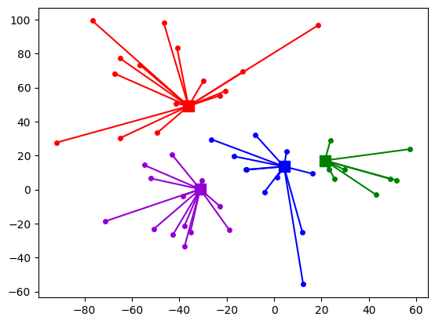

# MDVRPTW

<!--
*** Thanks for checking out the Best-README-Template. If you have a suggestion
*** that would make this better, please fork the repo and create a pull request
*** or simply open an issue with the tag "enhancement".
*** Thanks again! Now go create something AMAZING! :D
-->


<!-- PROJECT SHIELDS -->
<!--
*** I'm using markdown "reference style" links for readability.
*** Reference links are enclosed in brackets [ ] instead of parentheses ( ).
*** See the bottom of this document for the declaration of the reference variables
*** for contributors-url, forks-url, etc. This is an optional, concise syntax you may use.
*** https://www.markdownguide.org/basic-syntax/#reference-style-links
-->


<!-- PROJECT LOGO -->
<br />
<p align="center">
  <a href="https://github.com/israelpereira55/MDVRPTW-Solomon">
    
  </a>

  <h3 align="center">Let's solve the MDVRPTW!</h3>

  <p align="center">
    This is an algorithm that seeks to solve the MDVRPTW. 
    <br />
    The GRASP version of this project for the MDVRP was published on Computational Science and Its Applications – ICCSA 2022: 22nd International Conference, Malaga, Spain, July 4–7, 2022.
    <br />
  </p>
</p>


<!-- TABLE OF CONTENTS -->
<details open="open">
  <summary>Table of Contents</summary>
  <ol>
    <li>
      <a href="#about-the-project">About The Project</a>
    </li>
    <li>
      <a href="#getting-started">Getting Started</a>
      <ul>
        <li><a href="#prerequisites">Prerequisites</a></li>
        <li><a href="#installation">Installation</a></li>
        <li><a href="#flags-description">Flags description</a></li>
      </ul>
    </li>
    <li><a href="#contact">Contact</a></li>
    <li><a href="#acknowledgements">Acknowledgements</a></li>
    <li><a href="#references">References</a></li>
  </ol>
</details>


<!-- ABOUT THE PROJECT -->
## About The Project

The Vehicle Routing Problem (VRP) is a known hard-to-solve combinatorial problem (NP-hard). In this project, we seek to solve the Multi Depot Vehicle Routing Problem with Time Windows (MDVRPTW). 

We adopt the cluster-first route-second approach. For this, the customers are clustered considering each depot as the cluster center (each depot creates a cluster). Then the construction process is applied to generate solutions.

Currently, we use a randomized version of the Solomon I1 Insertion Heuristic as the constructive algorithm. The random decisions are administrated by the GRASP metaheuristic. After the construction process, a set of local search methods are applied. The local search can be intra-depot and inter-depot. The former considers each cluster as a complete problem and the latter considers all clusters to improve the solution. In this project, we consider both intra-depot and inter-depot local search methods.

The GRASP version of the project was published on Computational Science and Its Applications – ICCSA 2022: 22nd International Conference, Malaga, Spain, July 4–7, 2022. [Full article](https://link.springer.com/chapter/10.1007/978-3-031-10562-3_7).
    
We also aim to develop an Ant Colony Optimization algorithm, instead of GRASP, to solve the problem. Which is in progress...

For now, you can use the GRASP version.

**_If you use this code, please cite our article._**


### Clustering Methods

A set of clustering methods are utilized. 
* [K-Means]
* [Urgencies] _Giosa et al. [2]_


<!-- GETTING STARTED -->
## Getting Started

First, you need an MDVRPTW problem instance, which you can get on VRP Libraries.
We will list some libraries in which you can get them. We have the "instances" folder with Cordeuat and Vidal MDVRPTW instances, mostly for backup purposes but You can use them too!

You can also make your instance, but it needs to follow Cordeaut standards. 

* [VRP-REP](http://www.vrp-rep.org/variants/item/mdvrptw.html)
* [NEO LCC](https://neo.lcc.uma.es/vrp/vrp-instances/multiple-depot-vrp-instances/)

### Prerequisites

Python 3.6 or higher is required.


### Installation

1. Get the dependencies
   ```sh
   python -m pip install -r requirements.txt
   ```
2. Run the project
   ```sh
   python main.py <FLAGS>
   ```


<!-- USAGE EXAMPLES -->
### Flags description

Here we describe the algorithm parameters.

```bash
    main.py:
        (obrigatory)
        --instance: path to the MDVRPTW instance.
        (default: None)

        (optional)
        --cluster: the cluster method to use.
        (default: 'kmeans')
        (options: 'kmeans', 'urgencies')
```

* Example of usage:
   ```
   python main.py --instance ./instances/cordeau-al-2001-mdvrptw/pr01.txt --cluster kmeans
   ```


<!-- CONTACT -->
## Contact

Israel P. - israelpereira55@gmail.com

Project Link: [https://github.com/israelpereira55/MDVRPTW](https://github.com/israelpereira55/MDVRPTW)

[![LinkedIn][linkedin-shield]][linkedin-url]


<!-- ACKNOWLEDGEMENTS -->
## Acknowledgements
* [Best README Template](https://github.com/israelpereira55/MDVRPTW)


## References

[1] Cordeau, Jean-François, Gilbert Laporte, and Anne Mercier. "A unified tabu search heuristic for vehicle routing problems with time windows." Journal of the Operational research society 52.8 (2001): 928-936.

[2] Giosa, I. D., I. L. Tansini, and I. O. Viera. "New assignment algorithms for the multi-depot vehicle routing problem." Journal of the operational research society 53.9 (2002): 977-984.


<!-- MARKDOWN LINKS & IMAGES -->
<!-- https://www.markdownguide.org/basic-syntax/#reference-style-links -->
[linkedin-shield]: https://img.shields.io/badge/-LinkedIn-black.svg?style=for-the-badge&logo=linkedin&colorB=555
[linkedin-url]: www.linkedin.com/in/israelpsouza
[product-screenshot]: images/screenshot.png
